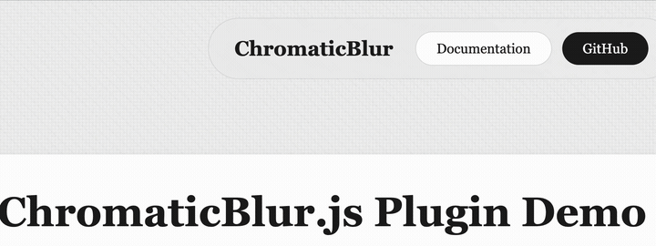

# ChromaticBlur.js

A lightweight (2.1 KB gzipped), zero-dependency JavaScript plugin for creating stunning chromatic aberration blur effects using SVG filters.

🔗 **[Live Demo](https://restyler.github.io/chromatic-blur/)** | 📦 **[npm](https://www.npmjs.com/package/chromatic-blur)**



## Features

- 🎨 Beautiful chromatic aberration with color channel splitting
- 🪶 Zero dependencies - pure vanilla JavaScript
- ⚡ Tiny footprint (2.1 KB gzipped) and performant
- 🔧 Highly configurable
- 🔗 Method chaining support
- 🧹 Automatic cleanup and memory management
- 📦 Multiple module formats (ES6, CommonJS, AMD, Global)

## Installation

### Via CDN (Recommended)

```html
<!-- Minified version (6.4 KB, 2.1 KB gzipped) -->
<script type="module">
  import ChromaticBlur from 'https://unpkg.com/chromatic-blur@1.0.0/dist/chromatic-blur.min.js';
  const blur = new ChromaticBlur('.element');
</script>

<!-- Development version with comments (10.5 KB) -->
<script type="module">
  import ChromaticBlur from 'https://unpkg.com/chromatic-blur@1.0.0/dist/chromatic-blur.js';
</script>
```

### Via npm

```bash
npm install chromatic-blur
```

```javascript
import ChromaticBlur from 'chromatic-blur';
```

## Quick Start

```javascript
// Basic usage
const blur = new ChromaticBlur('.my-element');

// With custom options
const blur = new ChromaticBlur('.navbar', {
  redOffset: 8,
  blueOffset: -8,
  blurAmount: 5
});
```

## Configuration Options

| Option | Type | Default | Description |
|--------|------|---------|-------------|
| `redOffset` | number | 5 | Red channel offset in pixels (positive = right) |
| `blueOffset` | number | -5 | Blue channel offset in pixels (negative = left) |
| `blurAmount` | number | 3 | Gaussian blur standard deviation |
| `turbulenceFrequency` | number | 0.001 | Turbulence noise frequency (lower = smoother) |
| `displacementScale` | number | 50 | Displacement map scale for wavy distortion |
| `borderColor` | string | 'rgba(156, 156, 156, 0.2)' | Border color for glass effect |
| `addOverlay` | boolean | true | Add gradient overlay layer |
| `addNoise` | boolean | true | Add noise overlay layer |

## API Methods

### Instance Methods

#### `update(options)`
Update effect options dynamically. Returns `this` for chaining.

```javascript
blur.update({ redOffset: 10, blurAmount: 6 });
```

#### `enable()`
Enable the effect (if previously disabled). Returns `this` for chaining.

```javascript
blur.enable();
```

#### `disable()`
Temporarily disable the effect. Returns `this` for chaining.

```javascript
blur.disable();
```

#### `destroy()`
Remove the effect and cleanup all resources.

```javascript
blur.destroy();
```

### Static Methods

#### `ChromaticBlur.destroyAll()`
Cleanup all instances. Useful for Single Page Applications.

```javascript
ChromaticBlur.destroyAll();
```

## Usage Examples

### Basic Navigation Bar

```javascript
const nav = new ChromaticBlur('.navbar', {
  redOffset: 5,
  blueOffset: -5,
  blurAmount: 3
});
```

### Intense Effect

```javascript
const hero = new ChromaticBlur('.hero-section', {
  redOffset: 15,
  blueOffset: -15,
  blurAmount: 8,
  displacementScale: 100
});
```

### Minimal Glass Effect

```javascript
const card = new ChromaticBlur('.card', {
  redOffset: 2,
  blueOffset: -2,
  blurAmount: 2,
  addNoise: false,
  addOverlay: false
});
```

### Method Chaining

```javascript
const blur = new ChromaticBlur('.element')
  .update({ blurAmount: 5 })
  .enable();

// Later...
blur.disable().update({ redOffset: 10 }).enable();
```

### Dynamic Control

```javascript
const blur = new ChromaticBlur('.navbar');

// Adjust based on scroll position
window.addEventListener('scroll', () => {
  const scrollPercent = window.scrollY / document.body.scrollHeight;
  blur.update({
    blurAmount: 3 + (scrollPercent * 10),
    redOffset: 5 + (scrollPercent * 10)
  });
});
```

### Cleanup in SPAs

```javascript
// React useEffect example
useEffect(() => {
  const blur = new ChromaticBlur('.navbar');

  return () => {
    blur.destroy(); // Cleanup on unmount
  };
}, []);

// Or cleanup all instances at once
ChromaticBlur.destroyAll();
```

## Browser Support

Works in all modern browsers that support:
- SVG filters
- CSS `backdrop-filter` (with `-webkit-` prefix for Safari)

For best results, ensure background content has sufficient contrast.

## Modern Best Practices Implemented

- ✅ **ES6+ Class-based architecture** - Clean, maintainable OOP design
- ✅ **No dependencies** - Pure vanilla JavaScript (2.1 KB gzipped)
- ✅ **Declarative API** - Intuitive method names and options
- ✅ **Method chaining** - Fluent interface pattern
- ✅ **Automatic cleanup** - Prevents memory leaks
- ✅ **TypeScript-friendly** - Comprehensive JSDoc comments
- ✅ **Multiple module formats** - Works everywhere
- ✅ **Performance optimized** - Reuses SVG filters, minimal DOM manipulation

## Performance Tips

1. **Reuse instances** - Don't create multiple instances for the same element
2. **Cleanup properly** - Always call `destroy()` when removing elements
3. **Moderate settings** - Higher values for blur/displacement are more expensive
4. **Limit instances** - Each instance creates an SVG filter; use sparingly

## License

MIT License - feel free to use in personal and commercial projects!

## Credits

Created as a demonstration of modern vanilla JavaScript plugin development.
